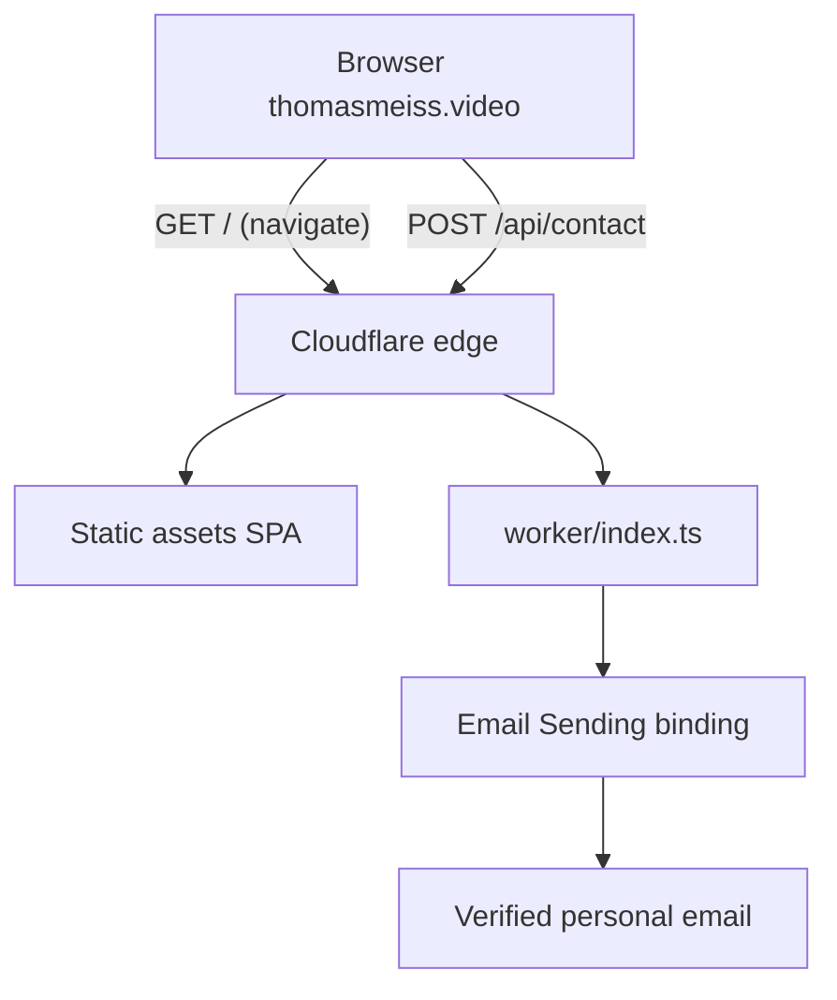

# Thomas Meiss Video — Noir Editorial Portfolio

**Site name:** Thomas Meiss Video
**Domain:** [thomasmeiss.video](https://thomasmeiss.video)
**Design direction:** Noir Editorial (dark cinema + magazine structure — unchanged from brief)

---

## Implementation status

| Todo | Status | Notes |
|------|--------|-------|
| Scaffold | Done | Manual setup; `create-cloudflare` failed on `thomasmeiss.video` folder name |
| Design tokens + UI primitives | Done | `src/index.css`, `PillButton`, `SectionLabel`, `AnimatedLink` |
| Content data | Done | `src/data/content.ts` |
| Sections (all 11) | Done | All components in `src/components/` |
| Contact API Worker | Done | `worker/index.ts` + generated `worker-configuration.d.ts` |
| Motion + a11y + SEO | Done | `motion` reveals, reduced-motion hook, skip link, form labels, meta/OG, `robots.txt` |
| Build / local dev | Done | `npm run build` passes; `npm run dev` works after removing default `remote: true` |
| Email setup | **Pending** | `CONTACT_TO@example.com` placeholder still in `wrangler.jsonc` |
| Analytics | **Pending** | Cloudflare Web Analytics — enable at deploy |
| Deploy + domain | **Pending** | Requires `wrangler login`, email config, `npm run deploy`, custom domain attach |

---

## Stack and hosting

| Layer | Choice |
|-------|--------|
| App | **Vite + React 19 + TypeScript + Tailwind CSS v4** |
| Motion | **`motion`** for staggered reveals and card hovers |
| API | **Cloudflare Worker** at `/api/contact` (not optional) |
| Email | **Cloudflare Email Service** — `send_email` binding delivers to verified personal inbox |
| Hosting | **Cloudflare Workers static assets** via `@cloudflare/vite-plugin` + `wrangler deploy` |
| Config | [`wrangler.jsonc`](wrangler.jsonc) |

Cloudflare Pages is deprecated for new work; this project uses **Workers + static assets** exclusively.

### Routing architecture

Static SPA for all page traffic; Worker invoked **only** for API routes (cost-efficient):

```jsonc
// wrangler.jsonc
{
  "$schema": "./node_modules/wrangler/config-schema.json",
  "name": "thomasmeiss-video",
  "main": "worker/index.ts",
  "compatibility_date": "2026-06-01",
  "compatibility_flags": ["nodejs_compat"],
  "assets": {
    "not_found_handling": "single-page-application",
    "run_worker_first": ["/api/*"]
  },
  "send_email": [
    {
      "name": "EMAIL",
      "allowed_destination_addresses": ["CONTACT_TO@example.com"]
    }
  ],
  "vars": {
    "CONTACT_FROM": "hello@thomasmeiss.video",
    "CONTACT_FROM_NAME": "Thomas Meiss Video",
    "CONTACT_TO": "CONTACT_TO@example.com"
  }
}
```



**Email clarification:** Contact form delivery uses **Email Sending** (outbound from Worker). **Email Routing** is still required to **verify the destination address** (personal Gmail/iCloud/etc.) and optionally to forward inbound mail at `hello@thomasmeiss.video` → personal inbox. Both are configured under Cloudflare **Email Service** in the dashboard.

---

## Agent skills and MCP tools to use during build

### Required — Cloudflare platform

| Resource | Path / access | Use for |
|----------|---------------|---------|
| **wrangler** skill | [`~/.claude/skills/wrangler/SKILL.md`](file:///Users/jeremymeiss/.claude/skills/wrangler/SKILL.md) | `wrangler.jsonc`, deploy, types generation |
| **workers-best-practices** skill | [`~/.claude/skills/workers-best-practices/SKILL.md`](file:///Users/jeremymeiss/.claude/skills/workers-best-practices/SKILL.md) | Worker handler patterns, no floating promises, observability |
| **cloudflare-email-service** skill | [`~/.claude/skills/cloudflare-email-service/SKILL.md`](file:///Users/jeremymeiss/.claude/skills/cloudflare-email-service/SKILL.md) | `send_email` binding, domain onboarding, CLI setup |
| **cloudflare** skill (plugin) | [`~/.cursor/plugins/cache/cursor-public/cloudflare/.../skills/cloudflare/SKILL.md`](file:///Users/jeremymeiss/.cursor/plugins/cache/cursor-public/cloudflare/fe4f2e9999991b36568e3d81a13de06a2b26bb20/skills/cloudflare/SKILL.md) | Platform decision tree, email-routing references |
| **Cloudflare Docs MCP** | `user-Cloudflare Docs` → `search_cloudflare_documentation` | Live docs lookup for Vite plugin, SPA routing, Email API |

Also available via Cloudflare plugin (same content as `.claude/skills/`): `wrangler`, `workers-best-practices`, `web-perf`.

### Required — Frontend and quality

| Resource | Path | Use for |
|----------|------|---------|
| **frontend-design** skill | [`~/.agents/skills/frontend-design/SKILL.md`](file:///Users/jeremymeiss/.agents/skills/frontend-design/SKILL.md) | Noir Editorial aesthetic execution |
| **tailwind-css** skill | [`~/.agents/skills/tailwind-css/SKILL.md`](file:///Users/jeremymeiss/.agents/skills/tailwind-css/SKILL.md) | Tailwind v4 `@theme`, utilities |
| **accessibility** skill | [`~/.agents/skills/accessibility/SKILL.md`](file:///Users/jeremymeiss/.agents/skills/accessibility/SKILL.md) | Form labels, focus states, reduced motion, skip link |
| **seo** skill | [`~/.agents/skills/seo/SKILL.md`](file:///Users/jeremymeiss/.agents/skills/seo/SKILL.md) | Meta tags, OG image, JSON-LD for LocalBusiness/CreativeWork |

### Recommended — Performance and verification

| Resource | Use for |
|----------|---------|
| **web-perf** / **core-web-vitals** skills | Font loading strategy, LCP for hero |
| **user-Playwright** or **user-Chrome DevTools** MCP | Post-build visual + a11y smoke test |

### Not needed for this project

- Netlify skills (hosting is Cloudflare Workers)
- Auth0 / Prisma / Render plugins
- Durable Objects, Agents SDK, D1 (no database)
- Cloudflare Workers Builds MCP (deploy via `wrangler deploy` locally or CI)

---

## Project scaffold

Initialize in `/Users/jeremymeiss/Dev/personal/thomasmeiss.video`:

```bash
npm create cloudflare@latest . -- --framework=react
```

> **Note (implemented):** `create-cloudflare` rejected the directory name (`thomasmeiss.video` contains a dot). Project was scaffolded manually with equivalent structure. All planned files exist and build succeeds.

**Keep** the scaffolded Worker entry point — trim only unused demo API routes. Add:

- `motion` — animations
- `tailwindcss` + `@tailwindcss/vite` — Tailwind v4

**Scripts** in [`package.json`](package.json):

- `dev` → `vite`
- `build` → `tac -b && vite build` (or `tsc -b && vite build`)
- `deploy` → `wrangler deploy`
- `types` → `wrangler types` (regenerate `Env` after binding changes)

---

## Contact API Worker

[`worker/index.ts`](worker/index.ts) — single fetch handler:

1. **CORS** — allow `POST` from same origin only
2. **Route** — `POST /api/contact` only; 404/405 elsewhere (assets handle the rest)
3. **Validate** — JSON body: `name`, `email`, `projectType`, `message`; reject if honeypot `bot-field` is filled
4. **Send** — `env.EMAIL.send({ to: destination via binding, from: CONTACT_FROM, replyTo: submitter email, subject, html + text })`
5. **Respond** — `{ ok: true }` or `{ ok: false, error }` with appropriate status codes

Run `npx wrangler types` after adding bindings — use generated `Env` type, never hand-write binding interfaces.

**Secrets / config (not committed):**

- Personal inbox address → `destination_address` in `wrangler.jsonc` (must be verified first) OR `allowed_destination_addresses` array
- Optional: `wrangler secret put TURNSTILE_SECRET` if Cloudflare Turnstile spam protection is added later

### Cloudflare dashboard setup (pre-deploy checklist)

1. **Email Routing** — enable for `thomasmeiss.video`; verify personal destination address via confirmation email
   `npx wrangler email routing enable thomasmeiss.video`
   `npx wrangler email routing addresses create <personal@email.com>`
2. **Email Sending** — onboard `thomasmeiss.video` (adds SPF/DKIM/DMARC DNS records automatically)
   `npx wrangler email sending enable thomasmeiss.video`
3. **Optional inbound rule** — forward `hello@thomasmeiss.video` → personal inbox (Email Routing rule in dashboard)
4. **Custom domain** — attach `thomasmeiss.video` + `www` to the Worker in dashboard
5. **Local dev** — `"remote": true` on `send_email` binding sends real test emails during `wrangler dev`

---

## Design system — Noir Editorial

Design tokens unchanged — near-black ground `#0a0a0b`, bone `#f4f1ea`, ember accent `oklch(0.72 0.17 48)`, Bodoni Moda + Manrope.

**Branding updates from original brief placeholder:**

- Logo / wordmark: **Thomas Meiss Video** (not "Sable & Frame")
- Hero italic accent on words like *documentary*, *story*, *frame*
- Footer copyright: Thomas Meiss Video
- `index.html` `<title>` and meta: "Thomas Meiss Video — Freelance Video Producer"

---

## Page structure (11 sections)

Same section order as brief. Key branding touchpoints:

| Section | Branding note |
|---------|---------------|
| Nav | Logo "Thomas Meiss Video" |
| Hero | Eyebrow + headline for freelance video producer |
| Contact | POST to `/api/contact`; success state "Sent — talk soon ✓" only after `{ ok: true }` |
| Footer | Thomas Meiss Video + social links |

All copy in [`src/data/content.ts`](src/data/content.ts).

---

## Motion, a11y, SEO

- Staggered `motion` reveals + CSS marquee (disabled under `prefers-reduced-motion`)
- Contact form: associated labels, `aria-live` region for success/error, visible focus rings on ember accent
- [`index.html`](index.html): description meta, OG tags, canonical `https://thomasmeiss.video`
- Optional [`public/robots.txt`](public/robots.txt): allow `/`, disallow `/api/`

---

## File tree (implemented)

```
thomasmeiss.video/
├── index.html
├── package.json
├── vite.config.ts
├── wrangler.jsonc
├── tsconfig.json
├── worker/
│   └── index.ts              # /api/contact + Email Sending
├── public/
│   ├── favicon.svg
│   └── robots.txt
└── src/
    ├── main.tsx
    ├── App.tsx
    ├── index.css
    ├── data/content.ts
    ├── components/
    │   ├── Nav.tsx
    │   ├── Hero.tsx
    │   ├── TrustMarquee.tsx
    │   ├── Showreel.tsx
    │   ├── WorkGrid.tsx
    │   ├── Services.tsx
    │   ├── Channels.tsx
    │   ├── About.tsx
    │   ├── Pricing.tsx
    │   ├── ContactForm.tsx
    │   ├── Footer.tsx
    │   └── ui/
    └── hooks/
        └── usePrefersReducedMotion.ts
```

---

## Deploy workflow

1. Complete Email Service domain + destination verification
2. Set `destination_address` in `wrangler.jsonc` to verified personal email
3. `npm run build && npx wrangler deploy`
4. Attach `thomasmeiss.video` custom domain in Cloudflare dashboard
5. Enable **Cloudflare Web Analytics** for the domain (dashboard or beacon — see Analytics section)
6. Test contact form end-to-end on production

**CI (optional):** GitHub Action with `cloudflare/wrangler-action` + `CLOUDFLARE_API_TOKEN` secret.

---

## Out of scope for v1

- Real showreel video embed (placeholder texture only)
- Cloudflare Turnstile / rate limiting (honeypot only in v1)
- CMS, multi-page routing (see below)
- Inbound email auto-reply Worker (optional future: Email Routing rule without Worker code)

---

## Analytics — Cloudflare Web Analytics (chosen)

Privacy-oriented, free analytics hosted on Cloudflare. No third-party cookies; typically no cookie-consent banner required for basic pageview tracking (verify against your jurisdiction).

### Setup (at or after deploy)

**Option A — Dashboard (recommended if domain is proxied through Cloudflare)**

1. Deploy Worker and attach **thomasmeiss.video** as a custom domain (orange-cloud / proxied).
2. In dashboard: **Analytics & logs** → **Web Analytics** → **Add a site** → select `thomasmeiss.video`.
3. Metrics appear in the Web Analytics dashboard (page views, referrers, countries, Core Web Vitals).

No code change required when automatic injection is enabled for the zone.

**Option B — Beacon snippet (explicit / fallback)**

If automatic setup isn’t available, add the tokenized beacon to [`index.html`](index.html) before `</body>`:

```html
<script
  defer
  src="https://static.cloudflareinsights.com/beacon.min.js"
  data-cf-beacon='{"token": "<WEB_ANALYTICS_TOKEN>"}'
></script>
```

Token comes from the Web Analytics site setup in the dashboard. Use `defer` to avoid blocking render.

### Implementation notes

- Do **not** commit the beacon token if the repo is public — use an env var at build time or rely on dashboard auto-injection.
- Web Analytics covers **traffic and performance**, not custom conversion events (e.g. contact-form submits). For that later, consider Workers Analytics Engine or Zaraz — out of scope until needed.
- Skip loading the beacon in local dev (only inject when `import.meta.env.PROD` or omit from `index.html` until production).

---

## Future scope — CMS and multi-page routing

Deferred to v2+ — adds content workflow or routing complexity beyond the current single-page SPA. A **blog** can be added independently (often shares CMS + routing pieces below).

### CMS (Content Management System)

**What it is:** A way to edit site copy, projects, pricing, and media **without** redeploying from code — e.g. marketing updates showreel links or adds a fifth portfolio piece.

**Typical options:**

| Approach | Effort | Notes |
|----------|--------|-------|
| **Git-based markdown/JSON** (e.g. `content/projects/*.md`) | Low–medium | Content in repo; edit locally or via GitHub UI; rebuild on deploy — fits static Workers SPA |
| **Headless CMS** (Sanity, Contentful, Decap) | Medium | Admin UI for non-devs; fetch at build time (SSG) or at runtime via Worker API + cache |
| **Cloudflare D1 + simple admin** | High | Full custom: schema for projects/posts, auth-protected `/admin` Worker routes, API for CRUD |

**Entailed work:** Content model (projects, services, posts), migration from `src/data/content.ts`, build-time fetch or runtime API, image hosting (R2 + Image Resizing or CMS CDN), preview workflow, and who maintains content.

### Multi-page routing

**What it is:** Moving from one scrollable page (`#work`, `#contact`) to distinct URLs — e.g. `/`, `/work/voices-of-the-valley`, `/blog`, `/contact`.

**Why it matters:** Better SEO for individual projects/posts, shareable deep links, separate layouts per section.

**Entailed work on this stack:**

1. **Router** — Add `react-router` (or TanStack Router); split `App.tsx` into route-level pages.
2. **Wrangler SPA config** — Already set: `not_found_handling: "single-page-application"` serves `index.html` for unknown paths; no change unless you add SSR.
3. **New pages** — `WorkDetail`, `BlogIndex`, `BlogPost`, etc.; nav updates from hash links to `<Link to="...">`.
4. **SEO per route** — Dynamic `<title>` / meta (e.g. `react-helmet-async` or Vite SSR later); sitemap generation.
5. **Optional SSR** — Not required for v2 client routes; only if you need crawlable HTML without JS for every URL.

**Relationship to blog:** A blog almost always needs multi-page routing (`/blog`, `/blog/:slug`) plus a CMS or markdown pipeline — but you can add a blog later without adopting a full CMS if posts live as markdown in the repo.

